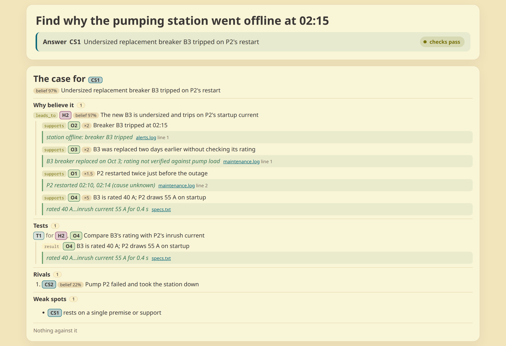

# reasoning-graph

An agent skill that makes the agent keep its reasoning as a graph: what it saw, what it suspects, what it tested, and which answer it claims.

Use it for tasks where a linear chain of thought drifts: puzzles, root-cause analysis, ambiguous debugging, planning under uncertainty.



## Install

```bash
npx skills add xian0x5a/reasoning-graph
```

Requires [uv](https://docs.astral.sh/uv/) on `PATH`.

## How it works

The graph does three jobs. It does not plan the work; the agent solves the problem its own way and keeps the record.

**1. Memory.** The agent writes what each step produced into `state.json`:

- `observation`: a fact, with its `source` and a verbatim `quote`
- `hypothesis`: a claim not yet established
- `test`: a check that would settle a claim, then its result
- `candidate_solution`: a possible answer to the goal

Edges say how they relate: `supports`, `contradicts`, `leads_to`, `prompts`, `requires`, `answers`.

After a context reset, the agent rereads `state.index.md`: one line per node and edge, with open work on top.

**2. Answer check.** The agent names its answer, then runs `audit`. The claim passes only when:

- the answer is a recorded candidate, grounded in observations rather than in scores
- every quote appears verbatim in the file its `source` names
- every test has a result, or a reason it was not run

If the user rejects the answer, the agent records the rejection as evidence and keeps working in the same graph.

**3. Progress view.** Every `record` refreshes `state.html`, so a human can follow along live. The agent scores claims and evidence on a 1–5 scale only where the default is wrong; the page turns those scores into a belief per claim, so a reader can see why one candidate outranks another and catch a weight that looks off. Belief is computed for the reader only: the state stores none and `audit` ignores it.

## Usage

The agent drives the CLI. A typical run:

```bash
reasoning-graph init --goal "Diagnose outage" -o state.json

# once per checkpoint: applies the patch, refreshes state.html and state.index.md
reasoning-graph record state.json --patch - <<'JSON'
{
  "nodes": [
    {"id": "O1", "type": "observation", "text": "Pump P2 restarted twice before the outage",
     "source": "maintenance.log line 40", "quote": "P2 restarted 02:10, 02:14"},
    {"id": "T1", "type": "test", "text": "Compare the outage start with the restart times"}
  ],
  "edges": [{"from": "O1", "to": "T1", "type": "prompts"}]
}
JSON

# read-only check of the graph, the quotes, and the claimed answer
reasoning-graph audit state.json
```

The full contract lives in [`skills/reasoning-graph/SKILL.md`](skills/reasoning-graph/SKILL.md). JSON Schemas ship with the CLI: `reasoning-graph schema state`, `reasoning-graph schema patch`.

## Development

Skill instructions live in `skills/reasoning-graph/`; the Python package, CLI, and tests in `packages/reasoning-graph/`. From the repo root:

```bash
uv --project packages/reasoning-graph run reasoning-graph audit packages/reasoning-graph/tests/fixtures/valid/reasoning-graph-strict-good.json
uv --project packages/reasoning-graph run --group dev pytest packages/reasoning-graph/tests/cli packages/reasoning-graph/tests/integration -q
```

Generated reports, HTML, and Mermaid files go in `test-results/` or `/tmp`, not git.
