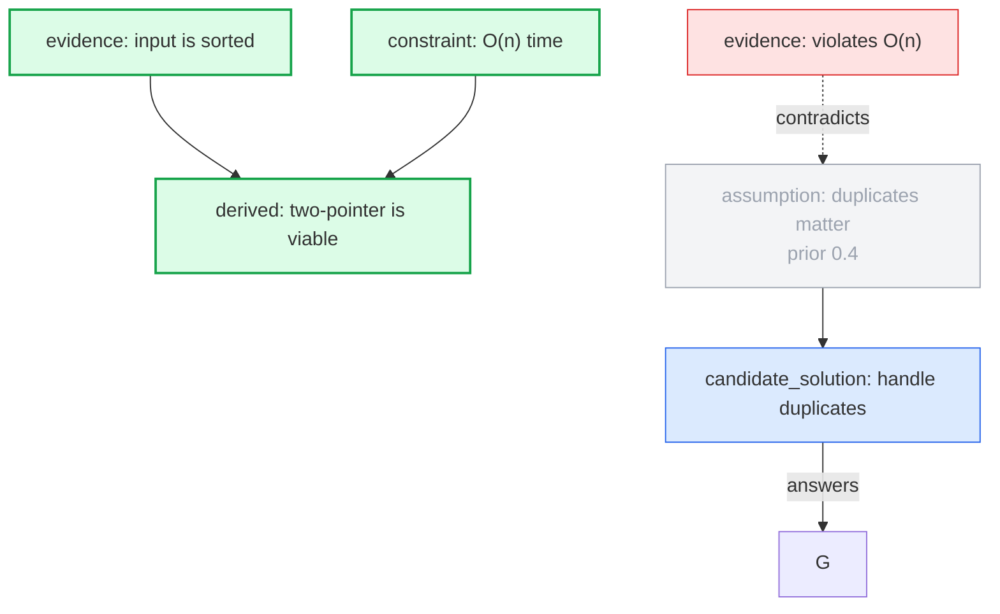

# Reasoning Graph

Use this skill to solve problems as a reasoning graph instead of a single linear chain.

Core idea: start from available evidence and constraints, derive what follows, and when direct derivation is not obvious, explore hypothetical branches with priors and path costs. This is graph search over possible routes to truth.

Default output is compact. Use graph output only when requested or when the graph would materially improve understanding; ask before creating graph artifacts if not explicitly requested.

## Core Model

### Node Types

Use this canonical set:

- `goal` — target to prove, solve, decide, or explain
- `evidence` — observed, given, verified, or source-backed statement; may support or contradict other nodes via edges
- `constraint` — boundary that valid answers must satisfy; constraints add cost or block goal satisfaction when explicitly required
- `derived` — conclusion derived from prior nodes
- `assumption` — uncertain branch point with a numeric prior
- `test` — action, experiment, check, or evidence-gathering step; use `status` to distinguish proposed checks from performed ones
- `candidate_solution` — possible answer under current assumptions; must connect to a goal with `answers` and include `answer_kind`.

### Edge Types

Use this canonical set:

- `requires` — hard dependency; when involving constraints, prefer `goal -> constraint` or `candidate/branch -> constraint`, not `constraint -> goal`
- `supports` — positive evidence update or soft reason in favor; numeric updates use `likelihood` or `likelihood_ratio > 1`
- `assumes` — branch proceeds under an assumption
- `contradicts` — negative evidence update; numeric updates use `likelihood` or `0 < likelihood_ratio < 1`. It does not delete/disqualify the target; decisive contradictions become very high truth cost / near-zero belief.
- `prompts` — non-evidential provenance; source node motivates a test, assumption, branch, or follow-up node without changing belief by itself
- `leads_to` — premise/dependency used to derive the target; incoming `leads_to` edges form the target's base belief and are treated as independent unless covered by `premise_groups`
- `answers` — candidate solution satisfies a goal; must be `candidate_solution -> goal`

For multi-premise derivations, a `derived` node may have multiple incoming `leads_to` edges. Treat plain incoming premises as jointly required and independent for that conclusion. Use `supports`/`contradicts` for evidence that updates belief in an existing target, and `requires` for constraints or external dependencies the derived/candidate must satisfy.

Use top-level `premise_groups` only when two or more incoming `leads_to` premises for the same target are non-independent, such as shared source, duplicate evidence, logical overlap, or common latent cause. Group presence means non-independent; do not create groups for independent premises. Each group requires `id`, `target`, `premises`, and `joint_probability`; it should include a short `reason`. Its `joint_probability` replaces the independent product for those grouped premises; ungrouped incoming premises still contribute independently.

```json
{
  "premise_groups": [
    {
      "id": "PG1",
      "target": "D1",
      "premises": ["A1", "B1"],
      "joint_probability": 0.72,
      "reason": "A1 and B1 share the same source, so they are not independent."
    }
  ]
}
```

Relationships are source of truth. Avoid manual `status` fields when they duplicate graph-derived view state such as winning/rank/dimmed/viable/rejected. In this schema, `status` is reserved for `test` nodes only.

Test node statuses:

- `proposed` — recommended next verification; not yet evidence and should not be treated as support. Renderers should visually distinguish it from evidence, e.g. shorter `proposed` label, different color, and dashed/dotted `prompts` edge.
- `performed` — check was conducted; add resulting `evidence`/`derived` nodes and connect them to affected branches
- `inconclusive` — performed but did not settle the claim

When a proposed test is later conducted, resume by updating the test node status to `performed` or `inconclusive`, adding the result as a new evidence/derived node when there is a result, incrementing `evidence_version` if ranking changes, and re-sorting affected active frontier items. Score changes alone do not reopen exhausted work. If evidence creates new work for an already-visited node, add a new frontier item for that node; if it only changes ranking/penalty, close the expansion with `no_new_work_reason`. Use `exhaustion_reason` only when marking a node or family `exhausted: true`. Keep the original proposed test node so the audit trail shows the recommendation-to-result transition.

Canonical pattern: `test` node = procedure; result `evidence` node = observed output. Example: `A1 --prompts--> T1`, `T1 --leads_to--> E9`, `E9 --contradicts--> A1`. Put `confidence` on the result evidence when scripts, OCR, external services, or manual transcription could be wrong.

## Input Ledger Extraction

User input often arrives as an unstructured block, not labeled evidence/constraints. Before branching, classify the provided input into a small ledger. This extraction step labels known inputs; acquiring missing evidence belongs to the exploration workflow.

Workflow:

1. Extract the `goal` from explicit request wording. If multiple goals conflict, ask or state the chosen primary goal.
2. Build the initial ledger from observed/source-backed inputs and requirements using the canonical Node Types above.
3. Keep plausible interpretations as initial assumptions/frontier branches, not evidence.
4. If a constraint is inferred from intent rather than explicit, mark it as inferred in the text or `source`; ask the user if it is high-impact or ambiguous.
5. Record source metadata on evidence/constraint nodes when useful:

```yaml
- id: E3
  type: evidence
  text: "Production logs show JWT signature verification failed"
  source: "user prompt"
  confidence: 0.95

- id: C2
  type: constraint
  text: "Avoid rotating all user sessions unless necessary"
  source: "explicit user requirement"
```

Keep the ledger concise. Merge tiny related evidence when that improves readability, but do not merge evidence that plays different logical roles in supporting or penalizing branches.

Graph-mode HTML must make evidence and constraint nodes readable with IDs and sources. A filterable node-detail list and node popup modals can satisfy this; do not duplicate a separate evidence/constraint ledger section when it makes the report longer without adding clarity.

## Hypothetical Branches

A hypothetical branch is an established reasoning chain under one or more assumptions. It represents one possible route to truth if the assumptions hold.

Rules:

- Treat derived nodes inside a hypothetical branch as conditional truth, not global truth.
- Every derived node under an assumption inherits dependency on that assumption until verified or proven independent.
- Do not create separate `solution` nodes. A final answer is the currently best-supported `candidate_solution`, chosen by evidence, constraints, and path cost.
- Use `candidate_solution -> goal` with `answers` when the candidate satisfies the goal.
- Do not make “not solved”, “cannot establish”, or “missing dependency” a `candidate_solution` for a normal solve goal. That is a stop outcome or derived blocker, not an answer.
- A true “no valid solution exists” candidate is allowed only when it answers an accepted epistemic/negative goal and is supported by positive impossibility evidence.
- A method/source branch is not a `candidate_solution` unless it itself answers the goal; keep it as `assumption` or `derived`.
- Do not point an `assumption` directly at a `goal`; validation rejects this. Route it through tests, derived conclusions, or candidate answers. Direct `assumption -> goal` usually smuggles “this branch solves the task” without evidence.

### Multiple Goals

Use multiple `goal` nodes when the user explicitly accepts more than one outcome, such as solving the puzzle, proving no valid solution exists, or deciding evidence is insufficient under constraints.

Optional top-level goal policy:

```json
{
  "goal_policy": {
    "accepted_goals": ["G1", "G2"],
    "preferred_goals": ["G1"]
  },
  "goal_groups": [
    {"id": "GG1", "goals": ["G1", "G2", "G3"], "exclusive": true}
  ]
}
```

Rules:

- If `accepted_goals` is absent, all goal nodes are acceptable destinations.
- `preferred_goals` affects presentation/priority discussion, not validity.
- `exclusive: true` means goals in that group are mutually incompatible outcomes; do not add noisy candidate-to-other-goal `contradicts` edges.
- Candidate viability is per accepted goal: `candidate_solution -> accepted goal` with `answers`.
- Goal-group exclusivity is logical incompatibility between outcomes; contradictions apply through general truth-cost penalties.

For a normal solve request, use one goal. For “solve it or prove impossible”, use two accepted goals. For “solve it or say evidence is insufficient”, add an explicit epistemic goal; then “insufficient evidence” may be a candidate only for that goal.

## Priors, Confidence, and Costs

Use probabilities only where they mean something.

- `prior`: belief before branch exploration, for hypotheses/assumptions/candidate claims.
- `confidence`: source/result reliability for evidence, derived claims, and noisy test observations.
- `posterior`: explicit updated belief after tests/evidence, if useful. Do not overwrite `prior`; it is the audit trail for the starting belief.
- Mutually exclusive sibling assumptions should form a local distribution that sums to `1.0`.
- Independent assumptions use independent priors and do not need to sum to `1.0`.
- Use coarse numeric values; avoid fake precision.
- Show priors/confidence/costs to the user only when they affect the conclusion, ambiguity, or branch ranking.

Helper-generated reports derive table `belief` from `effective_truth_cost`. `posterior` is an explicit calibrated override stored on the node; do not derive or overwrite it from path/search costs. If `posterior` is present, graph-derived likelihood updates are treated as already accounted for.

Evidence can be wrong. Official metadata may change, OCR can misread, transcripts can be stale, and local scripts can have bugs. Add `confidence` when source reliability matters. Do not force fake priors onto goals, constraints, or deterministic procedures.

Use `search_cost` to rank the next frontier action. Lower cost means explore earlier. `path_cost` is a legacy alias only; it is not cumulative path cost.

Recommended hybrid cost model:

```txt
truth_cost = -ln(P(claim true))
base_truth_cost(target) = local_truth_cost(target) + sum(effective_truth_cost(ungrouped premises via leads_to)) + sum(-ln(premise_group.joint_probability))
base_odds = P_base / (1 - P_base)
updated_odds = base_odds * product(likelihood ratios computed from supports/contradicts)
effective_truth_cost = -ln(updated_odds / (1 + updated_odds))

search_cost =
  effective_truth_cost(current node)
+ local_verification_cost
+ local_effort_budget
+ local_reasoning_complexity_cost
+ local_constraint_tension_cost
```

`truth_cost` measures current plausibility from the graph's probability model. `search_cost` measures what to investigate next by combining plausibility with local remaining effort/risk. Past work is sunk and does not accumulate into frontier priority. Priority queue order is by lowest `search_cost`, not highest belief alone.

Exact math is optional. Rough costs are acceptable when they preserve ordering and make the search better.

### Bounded Effort / Probe Priority

Brute-force, broad probing, sweeps, enumeration, or high-volume checking are not inherently low-cost just because a script is easy to run. Their search cost must include the committed effort budget.

A probe/brute-force branch may have low `search_cost` only when it is:

- tightly bounded (`max_attempts`, `max_seconds`, `max_items`, or equivalent),
- a cheap discriminator for a specific clue-derived hypothesis,
- stopped as soon as its budget or discriminator condition is reached,
- and recorded with `cost_components.effort_budget` plus `budget` metadata.

Example:

```json
{
  "id": "Q7",
  "node": "A7",
  "cost_components": {
    "truth": "auto",
    "verification": 0.2,
    "effort_budget": 0.3,
    "reasoning_complexity": 0.1,
    "constraint_tension": 0.0
  },
  "budget": {"max_attempts": 20, "max_seconds": 30, "stop_after": "first discriminating result"}
}
```

If the branch means broad brute force, open-ended enumeration, or spending most of the run budget, assign high `effort_budget` so frontier priority explores authoritative clues and cheap source/semantic checks first. Validator warns when a probe-like frontier item lacks both `effort_budget` and explicit `budget` metadata.

### Evidence Updates with Likelihoods

Use `likelihood` for numeric evidence updates on `supports` and `contradicts` edges. Prefer explicit conditional likelihoods over a bare ratio:

```json
{"from": "E1", "to": "A1", "type": "supports", "likelihood": {"if_target_true": 0.8, "if_target_false": 0.2}}
{"from": "E2", "to": "A1", "type": "contradicts", "likelihood": {"if_target_true": 0.1, "if_target_false": 0.7}}
```

The computed update is:

```txt
likelihood_ratio = P(evidence | target true) / P(evidence | target false)
```

- `supports` requires computed `likelihood_ratio > 1`.
- `contradicts` requires computed `0 < likelihood_ratio < 1`.
- `likelihood_ratio` is allowed as shorthand when already calibrated, but do not set both `likelihood` and `likelihood_ratio` on the same edge.
- Omit `likelihood`/`likelihood_ratio` when an edge is explanatory but not calibrated enough to affect ranking; without one, `supports`/`contradicts` has no numeric cost effect.
- Multiple update edges multiply in odds space.
- The likelihood update should already include source reliability. Evidence `confidence` is displayed/audited and contributes when that evidence is a `leads_to` premise; it does not automatically dampen a `supports`/`contradicts` update.
- Correlated/overlapping evidence should be merged, represented with a `premise_group` when it is part of a `leads_to` derivation, or represented with already-adjusted effective likelihoods; do not add a separate weight field.
- If an exact joint probability is known for required `leads_to` premises, use `premise_groups[].joint_probability`; if the whole target belief is calibrated, use explicit target `posterior` instead of stacking approximate updates.

`leads_to` is not a likelihood update. It forms the target's base belief by propagating ungrouped premise truth costs plus any `premise_groups[].joint_probability` costs. `supports`/`contradicts` then update that base belief. If a target has explicit `posterior`, treat it as calibrated and do not also count incoming premise or likelihood edges for that target.

If evidence changes `truth_cost`/`search_cost` for any stored frontier item, `costs` recomputes priorities and `sort`/`next` reorders active frontier by best-first priority. If the target node is already visited/exhausted, do not reopen it just because the score changed. Add a new frontier item only when the evidence creates new work. If no follow-up work exists, record event-level `no_new_work_reason`; if the node/family itself is complete, mark it `exhausted: true` with `exhaustion_reason`. Audit warns when evidence updates a visited node without either a new frontier item, `no_new_work_reason`, or node-level exhaustion proof.

## Search State

For complex tasks or graph mode, maintain explicit graph/search state in scratch notes. Do not dump raw state to the user unless useful or requested.

Separate graph nodes from search frontier items.

Example graph nodes:

```yaml
- id: E1
  type: evidence
  text: "The failing test is test_login_rejects_bad_token"
  source: "tests/auth_test.py::test_login_rejects_bad_token"
  confidence: 0.99

- id: C1
  type: constraint
  text: "Do not change public token format"
  source: "inferred from compatibility requirement"

- id: A2
  type: assumption
  text: "The root cause is stale cache"
  prior: 0.6
  prior_reason: "Common failure mode for this symptom"
```

Example frontier item:

```yaml
- id: Q7
  node: A2
  parent: Q3
  related: [E1, C1]
  scratch:
    - "Cache branch may split into stale-read vs invalidation-order variants."
    - "If this becomes important, promote it to a derived/test node."
  step_truth_cost: 0.51
  truth_cost: 0.51
  work_cost: 0.30
  step_cost: 0.81
  search_cost: 0.81
  active_assumptions: [A2]
  evidence_version: E1
```

Do not treat a frontier item as a prewritten one-step instruction. The `node` is the thing to expand; its text is the prompt. The parent chain is the main context. Use optional `related` only for extra node IDs worth reading that are not already on the parent path. Use optional `scratch` for pre-pop inspirations/reminders; scratch is not evidence, not a constraint, and not a ranking input. If a scratch item becomes important, promote it to a real `evidence`/`derived`/`test`/`assumption` node. After popping an item, digest the node, parent path, active assumptions, related nodes, and scratch, then generate multiple meaningful child branches, tests, or contradictions.

Use parent pointers instead of copying full paths. Reconstruct a path by walking parent links.

Use an expanded ledger to avoid loops, not to erase alternatives:

```yaml
expanded:
  - signature: "node=D4|assumptions=A2,A5|evidence=E1"
    item: Q9
    search_cost: 2.1
```

State signature minimum:

```txt
current_node + sorted active_assumption_ids + evidence_version
```

Guidelines:

- Skip exact cycles.
- Prefer expanding lower-cost frontier items first, best-first style.
- Do not hard-delete higher-cost or less-optimized paths solely because priors may be wrong.
- Keep multiple candidate paths in the frontier when they represent meaningfully different assumption chains or answer routes.
- If new evidence changes likelihood updates, an explicit posterior, or frontier ordering, increment `evidence_version` and allow relevant paths to reopen.

## Helper Script and Driver

For complex reasoning, use the helper as the search driver. The graph should choose the next work item before major search moves: substantial reasoning, branch selection, evidence-gathering tool use, searches, or tests. Skip the driver when the task is small enough that graph overhead would dominate, or when doing bookkeeping that does not change the search.

Use the helper for graph mode, multi-branch reasoning, frontier ranking, path reconstruction, and auditable artifacts. Bookkeeping can be done directly: fixing typos, adding an obvious source field, formatting JSON, recomputing costs, validation, Mermaid/HTML generation, or writing the final report from an already-settled state.

```bash
./scripts/rg.py validate state.json       # schema/reference/cost sanity checks
./scripts/rg.py costs state.json          # compute truth_cost/search_cost; path_cost kept as legacy alias
./scripts/rg.py audit state.json          # audit strict-search compact events
./scripts/rg.py sort state.json           # compute costs and sort frontier by search_cost
./scripts/rg.py sort state.json -i        # rewrite state.json sorted in place
./scripts/rg.py frontier state.json       # show active frontier derived from events
./scripts/rg.py next state.json           # show lowest-cost active item + path context
./scripts/rg.py next state.json --pop -i  # persist init/pop event for lowest-cost item
./scripts/rg.py expand state.json --item Q7 --patch expansion.json -i
./scripts/rg.py select state.json --node CS1 -i
./scripts/rg.py stop state.json --reason "best candidate verified" --outcome solved -i
./scripts/rg.py path state.json Q7        # reconstruct parent-pointer path
./scripts/rg.py mermaid state.json        # emit Mermaid source
./scripts/rg.py html state.json -o /tmp/reasoning-graph-example.html
```

Run commands from the skill directory, or use the absolute script path.

State JSON shape:

```json
{
  "summary": {
    "title": "Reasoning Graph",
    "answer": "Compact answer shown above the graph."
  },
  "nodes": [
    {"id": "G1", "type": "goal", "text": "Solve the problem"},
    {"id": "E1", "type": "evidence", "text": "Observed failure", "source": "user prompt", "confidence": 0.95},
    {"id": "C1", "type": "constraint", "text": "Must preserve API", "source": "inferred from user intent"},
    {"id": "A1", "type": "assumption", "text": "Likely route", "prior": 0.6},
    {"id": "CS1", "type": "candidate_solution", "text": "Candidate answer", "answer_kind": "exact_answer"}
  ],
  "edges": [
    {"from": "A1", "to": "CS1", "type": "leads_to"},
    {"from": "CS1", "to": "G1", "type": "answers"}
  ],
  "frontier": [
    {
      "id": "Q1",
      "node": "A1",
      "parent": null,
      "cost_components": {
        "truth": "auto",
        "verification": 0.2,
        "reasoning_complexity": 0.1,
        "constraint_tension": 0
      }
    }
  ],
  "stop_policy": {
    "min_viable_candidates": 3,
    "belief_threshold": 0.8,
    "max_live_frontier_items": 0,
    "require_frontier_exhausted_for_epistemic_stop": true,
    "severity": "warning"
  },
  "branch_policy": {
    "high_salience_min_children": 3,
    "low_prior_wildcard_required": true,
    "enforce_on": "exhaustion_stop",
    "severity": "warning"
  },
  "report": {
    "candidates": [
      {
        "id": "CS1",
        "name": "Likely route",
        "belief": 0.6,
        "search_cost": 0.810826,
        "path_nodes": ["E1", "C1", "A1", "CS1"],
        "why": "Lowest explored search cost and satisfies constraints",
        "next_test": "Verify supporting evidence"
      }
    ],
    "winning_path": ["Observed failure", "Likely route", "Candidate answer"],
    "next_verification": "Verify supporting evidence"
  },
  "presentation": {
    "include_nodes": ["E1", "C1", "A1", "G1"],
    "highlight_nodes": ["A1", "G1"],
    "dim_nodes": [],
    "layout_hint": "evidence-left-candidates-right"
  },
  "events": [
    {"step": 1, "action": "init", "frontier": ["Q1"]},
    {"step": 2, "action": "pop", "item": "Q1", "cost": 0.810826},
    {"step": 3, "action": "stop", "reason": "sample complete", "outcome": "frontier_exhausted"}
  ],
  "view": {
    "winning_path": ["A1", "G1"],
    "dimmed_branches": []
  }
}
```

Cost behavior:

- `truth: "auto"` or legacy `uncertainty: "auto"` uses effective node truth cost: explicit `posterior` when present; otherwise local probability plus ungrouped incoming `leads_to` premise costs and `premise_groups[].joint_probability` costs, then `supports`/`contradicts` likelihood updates.
- `truth_cost` is the current node's effective truth cost. `step_truth_cost` is kept as a legacy mirror of `truth_cost`.
- `work_cost` is local remaining work/risk for this next expansion: verification, effort budget, reasoning complexity, and constraint tension.
- `step_cost` and `search_cost` are the frontier priority score: `truth_cost + work_cost`. Parent pointers do not accumulate cost; past work is sunk.
- `path_cost` is emitted only as a legacy alias for `search_cost`, not cumulative path cost.
- `sort` keeps all frontier items but orders them by ascending `search_cost`.
- `frontier` derives the currently active virtual frontier from `events`; before any pop event, all frontier items are active.
- `next --pop -i` appends `init` when needed, then a `pop` event for the lowest-cost active item. If a popped item has not been expanded/selected, `next --pop` refuses to continue.
- `expand --patch` appends new nodes/edges/frontier items and records one `expand` event for the pending popped item.
- `path` reconstructs a proof/search path from parent pointers.
- `audit` checks compact strict-search events for coherent best-first expansion.

Expansion patch shape:

```json
{
  "summary": "Split the 74-byte clue into coarse container-format families.",
  "nodes": [
    {"id": "A8", "type": "assumption", "text": "WebCrypto AES-GCM layout family", "prior": 0.45},
    {"id": "A9", "type": "assumption", "text": "libsodium/secretbox layout family", "prior": 0.2}
  ],
  "edges": [
    {"id": "E20", "from": "A8", "to": "A4", "type": "supports"},
    {"id": "E21", "from": "A9", "to": "A4", "type": "supports"}
  ],
  "frontier": [
    {
      "id": "Q8",
      "node": "A8",
      "related": ["E1"],
      "scratch": ["Phrase length may matter, but branch container formats before committing."],
      "cost_components": {"truth": "auto", "verification": 0.4}
    },
    {
      "id": "Q9",
      "node": "A9",
      "related": ["E1"],
      "cost_components": {"truth": "auto", "verification": 0.5}
    }
  ]
}
```

`expand` fills missing child `parent` fields with the popped item id and records `add_nodes`, `add_edges`, `add_frontier`, and `add_premise_groups` ids for appended objects. Use `select` to record the chosen `candidate_solution` for the pending popped item. Use `stop` to append a stop event when search should end. Stop events must include structured `outcome`: `solved`, `candidate_threshold_met`, `candidate_count_met`, `frontier_exhausted`, `budget_exhausted`, `blocked`, `user_stopped`, or `inconclusive`. Expansion events may include `under_branching_reason` and `existing_sibling_frontier` when a high-salience branch legitimately adds fewer children than the branch policy floor.

An expansion patch can also add non-independent premise groups after the relevant `leads_to` premises already exist or are included in the same patch:

```json
{
  "edges": [
    {"id": "E31", "from": "B1", "to": "D1", "type": "leads_to"}
  ],
  "premise_groups": [
    {
      "id": "PG1",
      "target": "D1",
      "premises": ["A1", "B1"],
      "joint_probability": 0.72,
      "reason": "A1 and B1 share the same source."
    }
  ]
}
```

## Exploration Algorithm

Evidence acquisition boundary: input extraction only classifies known inputs. Before initializing the frontier, a bounded context pass may add cheap, source-backed evidence such as files, logs, docs, or web sources when allowed. After search starts, non-trivial checks, searches, or experiments should be modeled as `test`/frontier work; append observed result evidence during expansion.

Use this workflow:

1. Frame the `goal`.
2. Build the initial ledger from prompt/context inputs and source metadata where useful.
3. If cheap missing evidence is needed before branching, do a bounded context pass and add observed results to the ledger with sources.
4. Try direct derivation if obvious; otherwise initialize frontier from plausible assumptions or unresolved claims.
5. For each assumption, assign `prior`, truth cost, and reason. For uncertain evidence/results, assign `confidence`. Prefer branching from generic/structural assumptions first, then specialize with derived nodes or candidate solutions. Assumptions should be atomic/testable premises, not whole-solution-shaped duplicates of candidate answers.
6. Pop the frontier item with lowest current `search_cost`. For complex reasoning, use `./scripts/rg.py next state.json --pop -i` before major search moves: substantial reasoning, branch selection, evidence-gathering tool use, searches, or tests. Bookkeeping that does not change the search does not need a pop.
7. Digest the popped item and its reconstructed path, then do divergent expansion. Ask: what does this imply, what sibling hypotheses split from here, what cheap tests discriminate them, what contradictions would penalize them, and what candidate answer becomes possible? Add multiple meaningful child branches when available. In discovery-style tasks, create `candidate_solution` nodes only after a branch has enough clue/evidence support to be answer-shaped; do not preload final candidates as unexplored buckets.
8. If a result arrives during expansion, add it as evidence/derived evidence and add calibrated `supports`/`contradicts` likelihood edges or an explicit `posterior` update. Then add child frontier items and re-sort. Let best-first priority choose which child to explore next. Reopen only when evidence creates new work; score-only updates stay closed.
9. Continue until adaptive stopping conditions are met.
10. Return compact answer or graph artifact depending on output mode.

Default stopping behavior must be metric-gated, not discretionary.

A normal stop is acceptable when at least one is true:

- event-reachable frontier is exhausted,
- enough viable candidates have been explored (`min_viable_candidates`, default target usually 3 for comparison tasks),
- strongest viable candidate belief crosses an explicit threshold (for example `belief_threshold: 0.8`),
- an explicit external budget is reached and the graph records the remaining live frontier items as unfinished, not exhausted.

Do not select an epistemic/unresolved blocker while meaningful answer-goal frontier items remain live unless the state has an explicit stop policy allowing that. This is lazy-stop territory: the graph must prove search got enough candidates, got enough confidence, or genuinely exhausted/blocked the live frontier.

Recommended strict policy for benchmark/search tasks:

```json
"stop_policy": {
  "min_viable_candidates": 3,
  "belief_threshold": 0.8,
  "max_live_frontier_items": 0,
  "require_frontier_exhausted_for_epistemic_stop": true,
  "severity": "error"
}
```

With this policy, stopping is allowed if there are no live frontier items, or at least 3 viable candidates, or a viable candidate has belief >= 0.8. Selecting an unresolved/epistemic candidate while live frontier remains is an audit failure.

Other stopping rules:

- when the user asks for competing explanations/candidates, list ranked candidates only for branches that were actually expanded, directly tested, or explicitly supplied by the user and clearly marked as not yet explored
- early stop is allowed when the best candidate crosses the belief threshold, but then do not pad the ranked candidate list with unexplored alternatives; mention them only as unexpanded possibilities if useful
- stop early when alternatives are trivial or directly contradicted only if their likelihood updates make them clearly dominated, and record the contradiction evidence/cost impact
- contradicted candidate solutions may remain viable goal-linked candidates, but their lowered belief should not satisfy a high-confidence target unless the stop policy threshold still passes
- ask user before deepening search if more exploration would cost meaningful time

A candidate solution is valid only if it:

- reaches the goal or gives an actionable answer
- satisfies known constraints
- has no unresolved contradiction
- lists remaining assumptions or uncertainty
- has a search/truth cost estimate when branch ranking matters

Assumption and candidate hygiene:

- Prefer generic structural branch assumptions before specific final answers, e.g. `single-root-cause model`, `multi-factor interaction model`, `missing-configuration model`, `dependency/version mismatch model`.
- Specific assumptions are allowed when they are atomic/testable, e.g. `the config file is loaded from the expected path`, `the dependency version changed after the last working run`, or `input can arrive before initialization completes`.
- Avoid assumptions that already bundle the answer, e.g. `package X broke because config Y stopped loading after deploy Z`. Split that into a generic branch assumption plus derived/support nodes and a candidate solution.
- Litmus: if the assumption already answers the goal, or contains several uncertain premises joined together, make it a candidate/derived chain instead.
- Candidate solutions are usually conclusions of explored branches, not initial buckets for every imaginable answer. Start with assumptions/tests, expand clue/evidence chains, then emit a `candidate_solution` when the branch becomes complete enough to answer the goal.
- Early candidate placeholders are valid only when the option is user-supplied, already obvious from strong direct evidence, or useful as a low-priority hypothesis to test later.
- If a candidate enters the frontier before supporting evidence is expanded, give it appropriately high truth/constraint-tension cost and mark why it is weak or provisional. A jump-to-answer candidate without evidence should not outrank evidence-backed branches.
- Keep early candidates unresolved/unranked until each option has been expanded or directly contradicted by evidence. Ranked report candidates should correspond to explored/penalized branches, not merely imagined options. Evidence-contradicted candidates remain visible endpoints with lower belief; they are useful audit evidence and can remain viable only if their effective truth cost still meets the stop policy.
- Expand coarse possibility families first, not micro-variants. For example, create one frontier item for `WebCrypto AES-GCM layout family`, not 500 items for PBKDF2 iteration counts. Concrete variants belong inside the popped family expansion/test.
- Authoritative clue heuristic: if an official hint, doc, maintainer comment, theorem condition, log message, test failure, or other high-authority clue appears, spawn interpretation branches before brute-force branches. Mark the clue-family node with `clue_family: true` and `salience` (for example `0.8`) when dropping it would materially change the search. Interpretations of the clue usually deserve lower `verification` and `reasoning_complexity` cost than broad search because they can sharply reduce the space. Do not let concrete but expensive brute force outrank cheap interpretation of an authoritative clue.
- Bounded-negative heuristic: a failed bounded test penalizes only the exact tested interpretation, not the parent clue family. If a high-prior clue branch fails one direct test, add live frontier siblings for refined interpretations or add a derived node explaining why the whole family is actually exhausted. Do not convert `one tested variant failed` into `strong clue path dead`. No special backtracking mode is needed; best-first search continues by popping the next live frontier item.
- Partial-expansion/revival heuristic: popping a family/clue item means one expansion attempt, not permanent exhaustion. On first pass, expand obvious sibling interpretations broadly enough to avoid single-variant tunnel vision. If later evidence or a failed child shows the family was under-expanded, revive it by adding a new child `assumption`/`test` node under the original family node and a frontier item pointing to that child. Re-queueing the same family node is allowed only as a temporary continuation when no specific child branch can yet be named.
- Continuation invariant: when prior reports/evaluations are allowed but prior graph state is not, reconstruct high-salience clue families from the reports as explicit graph nodes. Do not collapse a clue family into generic “prior probes failed” evidence. If the family is not fully exhausted, it must have either a live frontier continuation or an `exhausted: true` node with `exhaustion_reason`.
- Divergence floor: for high-salience clue/family expansion, aim to create at least three child frontier branches: one direct/literal interpretation, one structural/transform interpretation, and one low-prior wildcard. Branching does not mean you must spend time on every branch immediately: search-cost ordering keeps low-prior or expensive branches low in the queue until better paths are exhausted or contradicted. Therefore adding a plausible low-prior branch is cheap and encouraged; silently omitting it is more dangerous than carrying it in the frontier. This is a soft floor by default, not a command to invent fake branches. If fewer branches are meaningful, record `under_branching_reason`, `existing_sibling_frontier`, or `exhausted: true` with `exhaustion_reason`. Audit defers branch-factor warnings until the stop reason claims exhaustion/completion, unless `branch_policy.enforce_on` is `always` or `severity` is `error`.
- A one-child expansion is a soft signal to reconsider whether meaningful sibling branches were missed. The goal is to reveal possible solution paths, not to make one chosen path look reasonable after the fact.

## Report Metadata

Use optional `report` metadata when graph/presentation mode needs a readable human report. This is presentation metadata only; source of truth remains `nodes`, `edges`, `frontier`, and optional `events`.

Recommended shape:

```json
"report": {
  "candidates": [
    {
      "id": "CS1",
      "name": "Candidate label",
      "belief": 0.45,
      "truth_cost": 0.798508,
      "search_cost": 2.24,
      "weight": 0.72,
      "path_nodes": ["E1", "D2", "CS1"],
      "why": "Explains the most evidence with lowest constraint tension",
      "next_test": "Run the decisive verification"
    }
  ],
  "winning_path": ["Evidence A", "Assumption B", "Derived C", "Candidate D"],
  "next_verification": "..."
}
```

Do not encode rank words such as `Best:`, `Second:`, `Third:`, `Weak:` in candidate `name` or node `text`. Frontier rank is derived by sorting items by `search_cost`; candidate belief ranking is derived from `truth_cost`/`belief`. The renderer can display ordinal rank. Avoid storing a `rank` field unless the ordering comes from an external criterion that is not derivable from cost/belief.

Do not put `status` on `candidate_solution` nodes. Candidate rank/viability is derived from belief/effective truth cost, search cost, goal `answers` edges, and `answer_kind`. If the candidate table needs labels such as viable or contradicted, express them in `why`, `next_test`, likelihood edges, or graph relationships, not node `status`.

Candidate `answer_kind` schema:

```txt
exact_answer       exact answer to the accepted goal, e.g. plaintext/value/name
exact_method       exact reproducible method that entails the accepted goal
method_hypothesis  plausible method branch, not enough to answer a concrete solve goal
clue_path          clue-family/path candidate for an explicit clue-finding goal
blocker            insufficiency/blocker candidate for an explicit epistemic goal
```

For concrete solve/exact-answer goals, only `exact_answer` and `exact_method` may connect to the accepted goal. `method_hypothesis`, `clue_path`, and `blocker` must target explicit method/clue/epistemic goals or remain assumptions/derived nodes. Strict states (`stop_policy.severity: "error"`) require `answer_kind` on every `candidate_solution`.

Optional `path_nodes` on a candidate lists the main node IDs that should be highlighted when a report viewer focuses that candidate. Renderers may also include upstream support evidence/constraints for positive path nodes so entry evidence remains visible. Contradicting evidence/test nodes may be highlighted when explicitly listed, but should not automatically pull in their own upstream evidence unless the UI has a separate “why rejected” mode. If omitted, viewers should conservatively focus the candidate node and directly connected support where possible.

Do not present computed weights as calibrated posterior probabilities. If useful, compute:

```txt
belief = exp(-effective_truth_cost)
weight = belief / sum(belief of displayed candidates)
```

Label `weight` as relative among displayed candidates, not a calibrated real-world probability. Use `posterior` only when explicit evidence/test updates a prior/confidence and the uncertainty remains clearly labeled.

Use optional `presentation` metadata for curated graph/report views. Baseline HTML uses the fixed graph heading “Best explanation graph”. `presentation.title` may still describe the story for custom renderers, but should not replace the default graph heading.

```json
"presentation": {
  "include_nodes": ["E1", "E2", "A1", "CS1"],
  "highlight_nodes": ["E1", "A1", "CS1"],
  "dim_nodes": ["CS2", "CS3"],
  "title": "Why candidate 1 wins",
  "layout_hint": "evidence-left-candidates-right"
}
```

Presentation views may omit low-value nodes for readability. They must not introduce claims absent from the reasoning state.

## Graph Driver Mode

Graph driver mode is the default for complex reasoning. It uses a compact `events` log plus `next --pop` / `expand` commands so the graph controls the next work item before the agent reasons. This reduces post-hoc graph decoration and makes the search trace auditable.

Do not include full frontier before/after snapshots; state already stores frontier items. Events record only search deltas:

```json
"events": [
  {"step": 1, "action": "init", "frontier": ["Q1", "Q2", "Q3"]},
  {"step": 2, "action": "pop", "item": "Q1", "cost": 1.15},
  {
    "step": 3,
    "action": "expand",
    "item": "Q1",
    "summary": "Generated coarse sibling explanations and cheap discriminator tests.",
    "add_nodes": ["A4", "A5", "T2"],
    "add_edges": ["E1", "E2"],
    "add_frontier": ["Q4", "Q5"],
    "updated_nodes": [{"id": "A1", "fields": ["posterior"]}],
    "no_new_work_reason": "A1 score changed, but no new A1-local work was implied."
  },
  {"step": 4, "action": "select", "item": "Q7", "node": "CS1", "cost": 2.24},
  {"step": 5, "action": "stop", "reason": "found 3 candidates; best dominates", "outcome": "candidate_count_met"}
]
```

Allowed actions:

- `init` — initial frontier item ids
- `pop` — selected lowest-cost frontier item
- `expand` — nodes/edges/frontier items created from the popped item. Add an outgoing edge from the popped node to at least one new test/result/child node so the graph topology shows the exploration, not only the event log. For partial family/clue expansion, add child branch nodes and frontier items for remaining live interpretations; use the same popped node again only as a temporary continuation when no child branch can yet be named. Optional `mode`/`summary` fields may describe the expansion, but they are not controlled vocabulary.
- `select` — chosen `candidate_solution` for this branch/search state
- `stop` — why search stopped; must include `outcome` enum (`solved`, `candidate_threshold_met`, `candidate_count_met`, `frontier_exhausted`, `budget_exhausted`, `blocked`, `user_stopped`, `inconclusive`)

Driver loop for search moves:

```bash
./scripts/rg.py frontier state.json
./scripts/rg.py next state.json --pop -i
# inspect popped node, parent path, active assumptions, and related nodes
# write expansion.json containing coarse child branches/tests/evidence
./scripts/rg.py expand state.json --item Q7 --patch expansion.json -i
./scripts/rg.py select state.json --node CS1 -i  # when a popped branch reaches the best current candidate
./scripts/rg.py stop state.json --reason "best candidate verified" --outcome solved -o state.stopped.json
# review stopped candidate; promote only on pass
cp state.stopped.json state.json
./scripts/rg.py frontier state.json
```

### Semantic Stop Review

Stop is two gates:

1. `./scripts/rg.py stop ... -o state.stopped.json` fast-fails structural issues without mutating the working state.
2. A semantic reviewer approves `state.stopped.json` before it is promoted.

If gate 1 fails, continue/repair search. If gate 2 fails, discard the stopped candidate and continue/repair. Bound retries to one reviewer repair pass unless the user asked for exhaustive work.

Prefer a fresh reviewer agent; otherwise switch roles. Reviewer reads the user request, stopped candidate state, original state if needed, and final answer draft. Do not solve from scratch except to check obvious missed contradictions or live branches.

Reviewer output:

```yaml
verdict: pass | fail
required_fixes: []
semantic_tricks_checked: []
notes: []
```

Required checks:

- stop outcome/reason matches accepted goal, selected candidate, and stop policy
- no meaningful answer-goal frontier remains hidden behind an epistemic/blocker stop
- high-salience clue/family nodes are expanded, live, or explicitly exhausted
- selected candidate answers the goal, satisfies constraints, and is not a placeholder/duplicate/non-answer
- blockers are not disguised as answer candidates for normal solve goals
- failed broad tests do not erase untested sibling interpretations or parent clue families
- contradictions/failures penalize only affected branches
- final answer draft matches graph state and invents no new evidence

Do not call `next --pop` again until the pending popped item is expanded, selected, or intentionally stopped. A one-child expansion is allowed when no useful sibling branch comes to mind; audit treats it as a soft warning to reconsider branching, not a failure.

Before final in driver mode, run:

```bash
./scripts/rg.py audit state.json
```

Treat audit warnings as actionable for benchmark/published artifacts. Either fix the state/events or explicitly explain why the warning is acceptable. In particular, if audit warns that `candidate_solution` nodes were not added or selected by driver events, do one of these before final:

- add proper `expand`/`select`/contradiction-penalty events for those candidates,
- demote them to assumptions/derived notes if they were only speculative ideas,
- or keep them out of `nodes` and mention them as unexpanded possibilities in prose/report metadata.

Do not call a strict trace clean while leaving unexplored candidate nodes that only decorate the final graph.

Audit checks:

- steps strictly increase
- `init` appears before search events
- `pop` item is currently in virtual frontier
- popped item has lowest current `search_cost`
- `expand` follows the most recent pop
- `add_frontier` items exist and usually parent to expanded item
- expansions whose popped graph node has no outgoing edge to added nodes get a soft trace-topology warning
- one-child non-terminal expansions get a soft under-branching warning only when the final stop claims exhaustion/completion, unless `under_branching_reason` or `existing_sibling_frontier` is recorded
- high-salience clue/family expansions below `branch_policy.high_salience_min_children` warn/fail on exhaustion/completion stops unless they include `under_branching_reason`, `existing_sibling_frontier`, or exhaustion proof; set `branch_policy.enforce_on: "always"` for noisy development audits
- candidate solutions contradicted by evidence remain nodes but should not satisfy belief/threshold targets unless their effective truth cost still passes
- `select` references a `candidate_solution` node
- `stop` has a reason

Limit: driver mode still cannot prove hidden cognition used best-first ordering; it makes the external search trace auditable and catches incoherent post-hoc traces. The `next --pop` / `expand` loop reduces post-hoc decoration by making the graph control the next work item before the agent reasons or uses tools.

## Output Modes

### Compact Mode

Default. Return:

1. answer or recommendation
2. winning proof path as concise user-facing rationale
3. key assumptions, if any
4. top competing candidate paths when ambiguity matters
5. contradictions or heavily penalized branches only if important
6. next test/action if uncertainty remains

When also creating HTML/graph artifacts, write the user-facing answer first or keep it complete in the final response. The visual artifact is extra output, not a substitute for clear prose reasoning.

Do not expose hidden chain-of-thought or raw scratch state. Provide a clear proof path / reasoning summary suitable for the user.

Example compact shape:

```md
Answer: ...

Proof path:
E1 -> C1 -> A2 (prior 0.6) -> D4 -> candidate S1

Why this wins:
- satisfies C1/C2
- lower path cost than S2
- test T1 supports A2

Other candidates:
- S2: possible, but needs expensive verification
- S3: contradicted by C2

Remaining uncertainty:
- verify T2 before treating S1 as final
```

### Graph Mode

Use when user asks for graph/visualization/HTML, or when agent recommends it and user approves.

Graph mode has two useful views:

- `audit graph` — complete/debuggable reasoning graph; good for checking reasoning completeness.
- best explanation graph — curated/lossy human report; good for communicating why the answer wins.

The full reasoning state is always the source of truth. Presentation graph can omit nodes, but must not invent evidence, constraints, candidate claims, or edges absent from the state/report metadata.

Create an HTML artifact as a report, not a fixed template. Choose the layout that best explains the case/problem. It must include:

- compact answer summary at top
- readable evidence and constraint node details with labels/sources, either in a filterable detail list or modal cards
- candidate ordering table when candidates exist
- a small curated presentation graph for communication, preferably canvas-navigable when graph is nontrivial
- a full audit graph in a pan/zoom canvas when the graph is large
- click-to-details for graph nodes, ideally without forcing the user away from the canvas
- winning path highlighted or listed
- candidate solutions connect to the goal with `answers`
- contradicted/heavily penalized branches dimmed or red
- next verification/action when available

Artifact location:

- ad hoc/default: `/tmp/reasoning-graph-<slug>-<timestamp>.html`
- persistent project artifact only when useful or requested: `./docs/reasoning-graphs/<slug>.html`

Prefer local Mermaid rendering if available; otherwise use Mermaid CDN. When the user or prompt asks for a reasoning graph, graph canvas, or an HTML report from this skill, the requested HTML output path must be generated from the validated state with `./scripts/rg.py html`. Custom self-contained SVG/HTML is allowed only as an additional artifact, or when the user explicitly asks for a bespoke non-helper report; do not replace the baseline graph/canvas report with a hand-written summary page.

For non-trivial HTML report generation, delegate presentation work to a low-thinking agent when possible. The solver should focus on the reasoning state; the renderer should consume `state.json` as source of truth and not solve again. If delegation is not available from the current context, write/validate `state.json` and clearly state that polished HTML rendering is a follow-up step for a low-thinking agent.

Delegation contract:

```txt
Read state.json. Generate polished self-contained HTML report. Do not solve again. Do not change reasoning. Do not invent evidence. State JSON is the only source of truth. If data is missing, render conservatively or report missing fields.
```

Recommended graph-mode flow:

1. Persist the graph/search state as JSON in `/tmp` unless the user asked for a project artifact.
2. For complex reasoning, build/update the state through the driver loop: `frontier` -> `next --pop -i` -> `expand --patch -i` -> repeat until stopping conditions are met.
3. Run `./scripts/rg.py costs state.json -i` or `./scripts/rg.py sort state.json -i` when candidate/frontier ranking matters.
4. Run `./scripts/rg.py validate state.json` and fix errors.
5. If driver events exist, run `./scripts/rg.py audit state.json` and fix errors or explain remaining warnings.
6. Generate the requested graph HTML path with `./scripts/rg.py html state.json -o <requested-output>.html`. The helper emits the baseline canvas report with a best explanation graph, full audit graph, node-detail popup modals, filterable detail cards, candidate focus dropdowns, and candidate table. Use `--spacing relaxed|wide|compact|default` to compare Mermaid spacing presets; default leaves Mermaid spacing unchanged.
7. If you also want a custom/polished summary page, save it separately as `<slug>-custom.html` or similar. Never use a custom summary page as the only artifact when graph mode was requested.
8. For separate graph sources, run `./scripts/rg.py mermaid state.json > <slug>.mmd`.
9. For polished presentation output, hand off `state.json`, optional `.mmd` files, optional style reference, and an extra output path to a low-thinking rendering agent. The renderer may design freely, but it must preserve the source-of-truth state and must not invent reasoning.
10. If network/external dependencies are disallowed, produce self-contained HTML/SVG or provide the `.mmd` plus a plain Markdown fallback.

Presentation/canvas rules:

- Presentation graph is curated and lossy: ideally 8-18 nodes, rarely more than 25. Use canvas mode for it too when labels/layout exceed the viewport.
- Full audit graph is complete and may be dense; put it in a canvas with pan/zoom instead of shrinking it until unreadable. Use subgraph grouping by node type when it improves relationship readability. Add edge interaction when possible: hover previews connected nodes, click pins the edge + endpoints, and Escape/blank-canvas click clears the pin.
- Prefer ID/type-only graph labels (`E3`, `CS1`, etc.) for dense graphs; keep full text in node-detail cards/modals.
- Use `short_text` only for small bespoke presentation graphs where the label is clearly readable and does not risk escaping/entity noise.
- Prefer click-to-details anchors over huge node labels.
- Mermaid supports node click links with tooltips, e.g. `click E15 "#details-E15" "Full detail"`; default UX should intercept clicks and open a popup/modal card so the user stays near the canvas. Keep anchor targets as no-JS fallback.
- If using Mermaid click links/callbacks, initialize with `securityLevel: "loose"` when needed.
- Do not expose only the full graph. Always include a readable presentation graph or equivalent visual summary.
- Avoid forcing scroll for normal node inspection. Prefer popup/modal detail cards.

Mermaid styling pattern:



HTML report design guidance:

- Avoid rigid, generic templates. Make the report serve the reasoning object.
- Put the answer/candidate ranking before the graph so users know what they are looking at.
- Use a small presentation graph for the main story; use the full audit graph only as an inspectable canvas.
- Keep graph labels short, preferably ID/type-only for dense graphs; route evidence text to filterable details cards and modal popups.
- Do not add a separate evidence/constraints section if the node details list already covers evidence and constraints with sources.
- Use Mermaid flowchart spacing (for example `nodeSpacing`, `rankSpacing`, curved edges) only when dense graphs look compressed; compare against default spacing first.
- Use `mermaid.initialize({ startOnLoad: true, securityLevel: "loose", flowchart: { htmlLabels: true, useMaxWidth: false } })` when using Mermaid click links and canvas sizing, and add spacing options only if needed.
- If using a full SVG graph, add pan/zoom controls or viewBox-based pointer navigation.

## Quality Checks

Before final answer, check:

- Is the goal explicit?
- Is evidence separated from constraints?
- Are assumptions scoped and assigned priors?
- Does every viable candidate solution answer the goal instead of merely naming a method/source branch?
- When a high-prior clue branch got a bounded negative result, did the graph refine sibling interpretations instead of treating the entire clue family as dead?
- If a family/clue node was only partially expanded, did the graph add child branch frontier items or explicitly justify family exhaustion?
- Did constraints add explicit cost/blocking evidence for invalid branches?
- Did search keep meaningful alternatives instead of stopping at first plausible answer?
- When an authoritative clue appeared, did the graph spawn and prioritize interpretation branches before brute-force or implementation-guessing branches?
- Are priors/costs shown only when useful?
- Is uncertainty labeled instead of hidden?
- For complex reasoning, was the state built or updated through the driver loop before major search moves, while trivial bookkeeping stayed lightweight?
- After `./scripts/rg.py stop` succeeded on a candidate state, did semantic stop review pass before the stopped state was promoted?
- If driver events exist, did `./scripts/rg.py audit` finish without unexplained warnings, especially unexpanded `candidate_solution` nodes?
- In graph mode, was the requested HTML artifact generated by `./scripts/rg.py html` from the validated state, not hand-written from scratch?
- Can the user open the HTML artifact and see summary + candidate table + evidence/constraint node details with sources?
- Is there a curated presentation graph, not only the full audit graph?
- If the full graph is dense, is it navigable with pan/zoom instead of tiny unreadable SVG?
- Do graph nodes open popup/modal detail cards without forcing the user away from the canvas?
