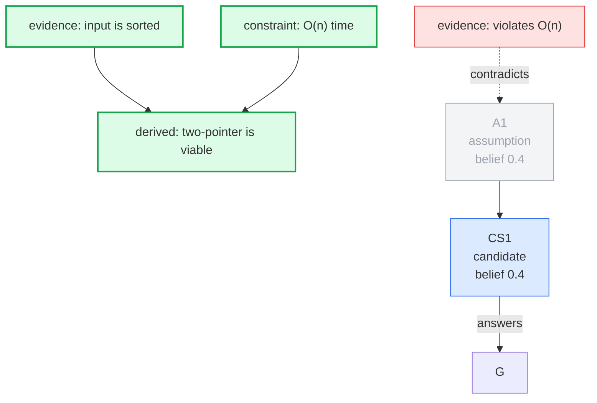

# Reasoning Graph Rendering Guide

Final prose, HTML artifacts, and visual presentation rules.

## Output Formats

### Default Final Response

Default. Return:

1. answer or recommendation
2. winning proof path as concise user-facing rationale
3. key assumptions, if any
4. top competing candidate paths when ambiguity matters
5. contradictions or heavily penalized branches only if important
6. next test/action if uncertainty remains

When also creating HTML/graph artifacts, write the user-facing answer first or keep it complete in the final response. The visual artifact is extra output, not a substitute for clear prose reasoning.

Do not expose hidden chain-of-thought or raw scratch state. Provide a clear proof path / reasoning summary suitable for the user.

Example compact shape:

```md
Answer: ...

Proof path:
E1 -> C1 -> A2 (prior 0.6) -> D4 -> candidate S1

Why this wins:
- satisfies C1/C2
- lower search cost than S2
- test T1 supports A2

Other candidates:
- S2: possible, but needs expensive verification
- S3: contradicted by C2

Remaining uncertainty:
- verify T2 before treating S1 as final
```

### Graph/HTML Artifacts

Create when user asks for graph/visualization/HTML, or when agent recommends it and user approves.

Graph/HTML artifacts may have two useful views:

- `audit graph` — complete/debuggable reasoning graph; good for checking reasoning completeness.
- explanation view — concise human report, optionally a curated/lossy graph, good for communicating why the answer wins.

The full reasoning state is always the source of truth. An explanation view can omit nodes, but must not invent evidence, constraints, candidate claims, or edges absent from the state/report metadata.

Create an HTML artifact as a report, not a fixed template. Choose the layout that best explains the case/problem. It must include:

- compact answer summary at top
- readable evidence and constraint node details with labels/sources, either in a filterable detail list or modal cards
- candidate ordering table when candidates exist
- a concise explanation view; this may be a curated graph or the full graph when it is already small/readable
- a full audit graph in a pan/zoom canvas when the graph is large or debugging transparency matters
- click-to-details for graph nodes, ideally without forcing the user away from the canvas
- winning path highlighted or listed
- candidate solutions connect to the goal with `answers`
- contradicted/heavily penalized branches dimmed or red
- next verification/action when available

Artifact location:

- requested/durable artifact path first, when the user or task names one
- project artifact path only when useful or requested, e.g. `./docs/reasoning-graphs/<slug>.html`
- ad hoc fallback only: `/tmp/reasoning-graph-<slug>-<timestamp>.html`

`reasoning-graph html` uses Mermaid by default for better graph layout. `reasoning-graph html --offline` switches to deterministic inline SVG fallback for air-gapped/no-network contexts and keeps Mermaid source in collapsible source blocks. When the user or prompt asks for a reasoning graph, graph canvas, or an HTML report from this skill, the requested HTML output path must be generated from the validated state with `reasoning-graph html`. Custom self-contained SVG/HTML is allowed only as an additional artifact, or when the user explicitly asks for a bespoke non-helper report; do not replace the baseline graph/canvas report with a hand-written summary page.

For non-trivial HTML report generation, delegate presentation work to a low-thinking agent when possible. The solver should focus on the reasoning state; the renderer should consume `state.json` as source of truth and not solve again. If delegation is not available from the current context, write/validate `state.json` and clearly state that polished HTML rendering is a follow-up step for a low-thinking agent.

Delegation contract:

```txt
Read state.json. Generate polished self-contained HTML report. Do not solve again. Do not change reasoning. Do not invent evidence. State JSON is the only source of truth. If data is missing, render conservatively or report missing fields.
```

Recommended graph/HTML flow:

1. Persist the graph/search state as JSON in the requested output path or durable artifact location; use `/tmp` only as an ad hoc fallback.
2. Build/update the state through the required driver loop in `../SKILL.md`: `next --pop` -> resolve with `expand --item`, `assign`, `rank`, or `stop`; repeat until stopping conditions are met.
3. Run `reasoning-graph costs state.json` or `reasoning-graph sort state.json` when recomputing candidate/frontier ranking outside the normal loop.
4. Run `reasoning-graph validate state.json` and fix errors.
5. If driver events exist, run `reasoning-graph audit state.json` and fix errors or explain remaining warnings.
6. Generate the requested graph HTML path with `reasoning-graph html state.json -o <requested-output>.html`. The helper emits the baseline canvas report with explanation/audit graph views, node-detail popup modals, filterable detail cards, candidate focus dropdowns, and candidate table. Use `--spacing relaxed|wide|compact|default` to compare Mermaid/offline spacing presets. Add `--offline` only when network/CDN use is disallowed.
7. If you also want a custom/polished summary page, save it separately as `<slug>-custom.html` or similar. Never use a custom summary page as the only artifact when graph/HTML output was requested.
8. For separate graph sources, run `reasoning-graph mermaid state.json > <slug>.mmd`.
9. For polished presentation output, hand off `state.json`, optional `.mmd` files, optional style reference, and an extra output path to a low-thinking rendering agent. The renderer may design freely, but it must preserve the source-of-truth state and must not invent reasoning.
10. If network/external dependencies are disallowed, produce self-contained HTML/SVG or provide the `.mmd` plus a plain Markdown fallback.

### Belief display

Claim nodes show `belief <value>` in both Mermaid and offline SVG, including nodes that inherit all their belief. This is the effective result used for candidate ranking, not the local `prior`. Compute it from the full state before filtering the presentation graph, so hidden premises and factors still contribute. Goals, constraints, and tests have no belief label.

Node details separate **Effective belief**, **Local prior**, and **Posterior override**, displaying authored fields only when present. For example, premise `0.8` and local prior `0.9` give a graph label `belief 0.72` and details `Local prior: 0.9`. A posterior override replaces the effective value without hiding the stored prior in details. Compact labels use three significant digits; details and candidate-table beliefs are rounded to six decimal places. Rendering never writes these computed values into node inputs.

Canvas rules:

- A curated explanation graph is optional. Use it when the full graph is too dense for the main story; aim for 8-18 nodes and rarely more than 25. If the full graph is already small/readable, it can serve as the explanation view.
- Full audit graph is complete and may be dense; put it in a canvas with pan/zoom instead of shrinking it until unreadable. Use subgraph grouping by node type when it improves relationship readability. Add edge interaction when possible: hover previews connected nodes, click pins the edge + endpoints, and Escape/blank-canvas click clears the pin.
- The canvas view is fitted to the graph, then wheel zoom stays between the fitted view and a 50x zoom-in. Drag panning is unbounded, so the graph can be dragged off the canvas like a document can be scrolled away; every canvas keeps a "Reset view" control that restores the fit. The canvas clips at its own edges, which is why the graph must fill the canvas box rather than sit in a short strip: Mermaid renders inside its own `pre.mermaid` wrapper, so that wrapper carries the canvas height.
- Wheel zoom is opt-in per canvas: the canvas must hold focus (click it or Tab into it) before the wheel zooms, otherwise the wheel keeps scrolling the page normally. The focused canvas is outlined and sits on a dotted sheet background so it is obvious which surface owns the scroll.
- Keep graph labels to ID/type plus effective belief on claims; keep full text and authored inputs in node-detail cards/modals.
- Use `short_text` only for small bespoke presentation graphs where the label is clearly readable and does not risk escaping/entity noise.
- Prefer click-to-details anchors over huge node labels.
- Mermaid supports node click links with tooltips, e.g. `click E15 "#details-E15" "Full detail"`; default UX should intercept clicks and open a popup/modal card so the user stays near the canvas. Keep anchor targets as no-JS fallback.
- If using Mermaid click links/callbacks, initialize with `securityLevel: "loose"` when needed.
- Do not expose only a dense full graph. For nontrivial graphs, include a readable explanation view such as a curated graph, winning-path list, or candidate-focused summary.
- Avoid forcing scroll for normal node inspection. Prefer popup/modal detail cards.

Mermaid styling pattern:



HTML report design guidance:

- Avoid rigid, generic templates. Make the report serve the reasoning object.
- Put the answer/candidate ranking before the graph so users know what they are looking at.
- Use a small explanation view for the main story when the full graph is dense; use the full audit graph as an inspectable canvas.
- Keep graph labels compact using the belief display above; route evidence text to filterable detail cards and modal popups.
- Do not add a separate evidence/constraints section if the node details list already covers evidence and constraints with sources.
- Use `reasoning-graph html --spacing relaxed|wide|compact|default` when dense graphs look compressed; compare against default spacing first.
- Use `reasoning-graph html --offline` when generated HTML must not require network access. Keep Mermaid source as source/fallback text in offline mode, not as a CDN runtime dependency.
- If using a full SVG graph fallback, add pan/zoom controls or viewBox-based pointer navigation.
